<!--
  RUDRA PATEL — GitHub Profile README
  Repository: https://github.com/Rudra-Patel-CS/Rudra-Patel-CS

  Animation assets:
    assets/terminal.svg
    assets/skills.svg
    assets/divider.svg

  Snake animation:
    .github/workflows/snake.yml
    The workflow publishes generated SVGs to the output branch.
-->

<div align="center">

<!-- Animated terminal hero -->


<br><br>

<!-- Social links -->
<a href="https://github.com/Rudra-Patel-CS">
  
</a>
<a href="https://www.linkedin.com/in/rudra-patel-cs/">
  
</a>
<a href="https://x.com/RudraPatel43842">
  
</a>
<a href="https://pin.it/6Jda5LriT">
  
</a>
<a href="mailto:rudrakpatel7041@gmail.com">
  
</a>

<br><br>


<br><br>


</div>

```console
rudra@charusat:~$ whoami
```

<div align="center">

### Rudra Patel

**B.Tech CSE @ CSPIT, CHARUSAT**  
**Cybersecurity • Machine Learning • DSA • Secure Software**

I build practical software, study how systems fail, and work toward building systems that
are harder to break.

</div>

```console
rudra@charusat:~$ cat ./stack --animate
```

<div align="center">



<br>


</div>

```console
rudra@charusat:~$ man rudra --section=collaboration
```

<details>
<summary><code>▸ open to collaborating on</code></summary>
<br>

Security projects at the beginner-to-intermediate level, anything in C++, Java or
JavaScript, and open source work touching security, automation or problem solving.
If you have a project that needs someone who will actually finish the task, reach out.

</details>

<details>
<summary><code>▸ looking for help with</code></summary>
<br>

Real-world attack and defense scenarios beyond lab conditions, practical ML applied
to security problems rather than toy datasets, and system design plus secure coding
review from people further along than me.

</details>

<details>
<summary><code>▸ ask me about</code></summary>
<br>

DSA and LeetCode problem-solving strategy, a realistic cybersecurity learning roadmap
for students, and what the B.Tech CSE path at CSPIT, CHARUSAT actually looks like
from the inside.

</details>

<details>
<summary><code>▸ currently learning</code></summary>
<br>

```text
0x00  C++ ................ depth over breadth; STL, memory model
0x01  DSA / DAA .......... trees, graphs, DP — paired with LeetCode reps
0x02  Cybersecurity ...... vulnerability classes, exploitation, defense
0x03  ML foundations ..... supervised → anomaly detection, feature design
0x04  Secure coding ...... input validation, authz patterns, threat modeling
```

</details>

<div align="center">

</div>

```console
rudra@charusat:~$ ls ./projects
```

<h3>
  <a href="https://github.com/Rudra-Patel-CS/Vendor-Bridge">▸ Vendor-Bridge</a>
</h3>

A procurement and vendor-management ERP — vendor onboarding, RFQ creation, quotation
comparison, approval workflows, purchase-order generation, invoicing, email notifications
and analytics, with role-based access for admins, procurement officers, vendors and managers.

<a href="https://github.com/Rudra-Patel-CS/Vendor-Bridge">
  
</a>


<div align="center">

</div>

```console
rudra@charusat:~$ git log --stat --all
```

<div align="center">

<!-- GitHub statistics -->


<br><br>

<!-- Contribution streak -->


<br><br>

<!-- Activity graph -->


<br>


</div>

```console
rudra@charusat:~$ tail -f contributions.log
```

<div align="center">

<!-- Contribution snake.
     Requires .github/workflows/snake.yml to run and publish the output branch. -->
<picture>
  <source media="(prefers-color-scheme: dark)" srcset="https://raw.githubusercontent.com/Rudra-Patel-CS/Rudra-Patel-CS/output/github-snake-dark.svg">
  <source media="(prefers-color-scheme: light)" srcset="https://raw.githubusercontent.com/Rudra-Patel-CS/Rudra-Patel-CS/output/github-snake.svg">
  
</picture>

<br><br>

<!-- GitHub trophies -->


<br><br>


</div>

```console
rudra@charusat:~$ cat ./connect
```

<div align="center">

<a href="mailto:rudrakpatel7041@gmail.com">
  
</a>
<a href="https://www.linkedin.com/in/rudra-patel-cs/">
  
</a>
<a href="https://github.com/Rudra-Patel-CS">
  
</a>
<a href="https://x.com/RudraPatel43842">
  
</a>
<a href="https://pin.it/6Jda5LriT">
  
</a>

<br><br>

<sub>Build. Break. Learn. Secure.</sub>

</div>

```console
rudra@charusat:~$ exit
logout — thanks for reading the whole session.
```
